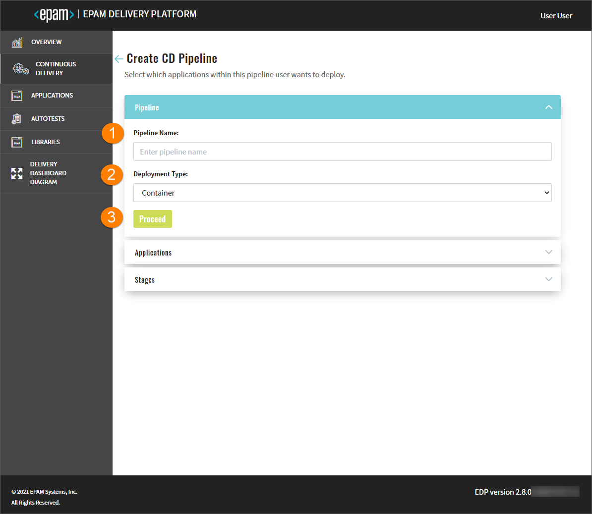
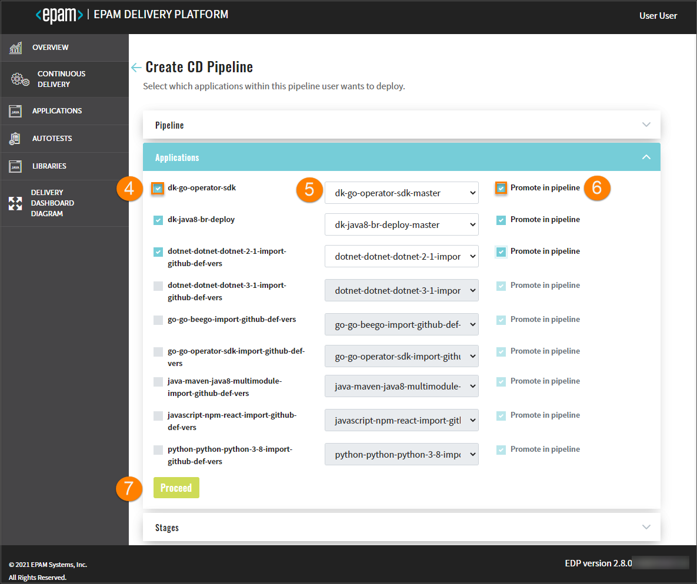
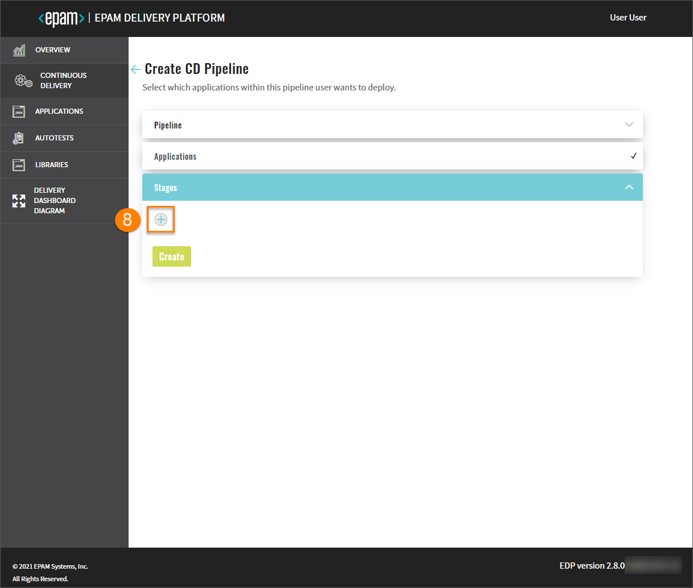
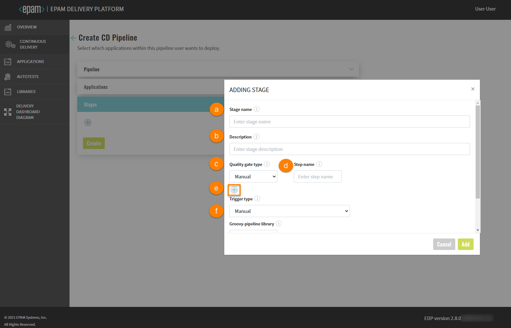
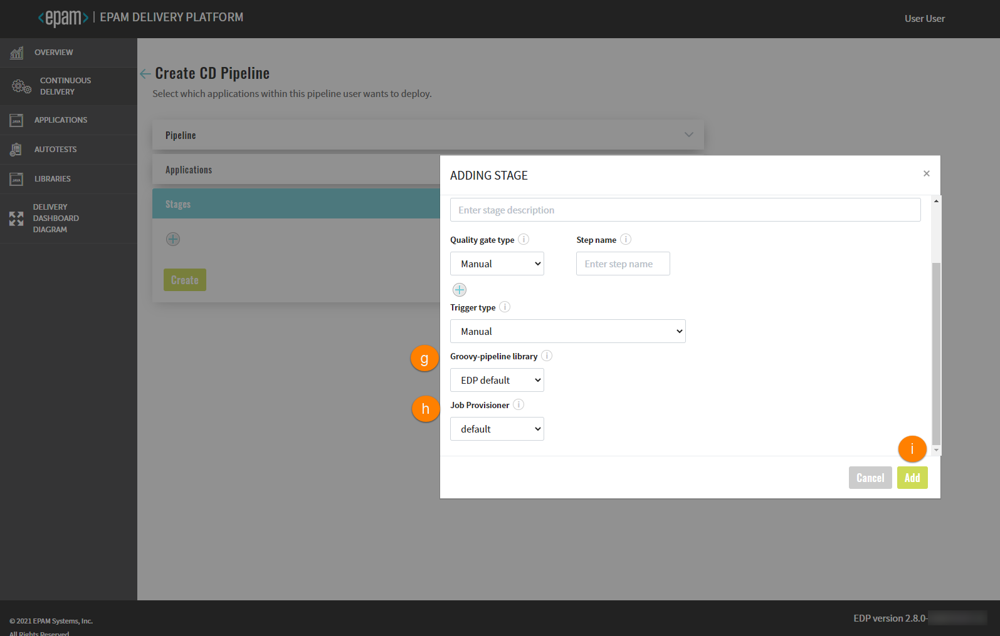
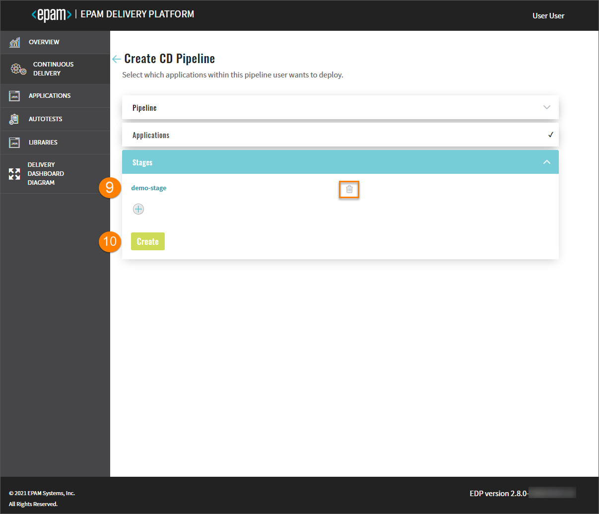

#  Add CD Pipelines

Admin Console provides the ability to deploy an environment on your own and specify the essential components as well.

Navigate to the **Continuous Delivery** section on the left-side navigation bar and click the Create button.
Once clicked, the three-step menu will appear:

* The Pipeline Menu
* The Applications Menu
* The Stages Menu

The creation of the CD pipeline becomes available as soon as an application is created including its provisioning
in a branch and the necessary entities for the environment.

## The Pipeline Menu

1. Type the name of the pipeline in the **Pipeline Name** field by entering at least two characters
and by using the lower-case letters, numbers and inner dashes.

   >_**NOTE**: The namespace created by the CD pipeline has the following pattern combination:
   **[cluster name]-[cd pipeline name]-[stage name]**. Please be aware that the namespace length should not exceed 63 symbols._

2. Select the deployment type from the drop-down list:
    - Container - the pipeline will be deployed in a Docker container;
    - Custom - this mode allows to deploy non-container applications and customize the Init stage of CD pipeline.
3. Click the Proceed button to be switched to the next menu.

    ## The Applications Menu

    

4. Select the check box of the necessary application in the **Applications** menu.
5. Specify the necessary codebase Docker stream (the output for the branch and other stages from other CD pipelines)
from the drop-down menu.
6. Select the **Promote in pipeline** check box in order to transfer the application from one to another stage
by the specified codebase Docker stream. If the Promote in pipeline check box is not selected,
the same codebase Docker stream will be deployed regardless of the stage, i.e. the codebase Docker stream input,
which was selected for the pipeline, will be always used.

   > _**NOTE**: The newly created CD pipeline has the following pattern combination: [pipeline name]-[branch name].
    If there is another deployed CD pipeline stage with the respective codebase Docker stream
    (= image stream as an OpenShift term), the pattern combination will be as follows:
    [pipeline name]-[stage name]-[application name]-[verified];_
    
7. Click the Proceed button to be switched to the next menu.

    ##  The Stages Menu

    

8. Click the plus sign icon in the **Stages** menu and fill in the necessary fields in the Adding Stage window:

   

    a. Type the stage name;
    
    >_**NOTE**: The namespace created by the CD pipeline has the following pattern combination:
     **[cluster name]-[cd pipeline name]-[stage name]**. Please be aware that the namespace length should not exceed 63 symbols._
    
    b. Enter the description for this stage;
    
    c. Select the quality gate type:

      - Manual - means that the promoting process should be confirmed in Jenkins manually;

      - Autotests - means that the promoting process should be confirmed by the successful passing of the autotests.
      In the additional fields, select the previously created autotest name and specify its branch for the autotest that
      will be launched on the current stage.

    d. Type the step name, which will be displayed in Jenkins, for every quality gate type;

    e. Add an unlimited number of quality gates by clicking a corresponding plus sign icon and remove them
           as well by clicking the recycle bin icon.
    
    f. Select the trigger type that allows promoting images to the next environment. The available trigger types are
    _manual_ and _auto_. By selecting the _auto_ trigger type, the CD pipeline will be launched automatically.

     >_**NOTE**: Execution sequence. The image promotion and execution of the pipelines depend on the sequence in which
    the environments are added._
   
   
    
    g. Select the groovy-pipeline library;
    
    h. Select the job provisioner. In case of working with non container-based applications, there is an option to use
    a custom job provisioner.
    Please refer to the [Add Job Provision](https://github.com/epam/edp-jenkins-operator/blob/master/documentation/add-job-provision.md#add-job-provision)
    page for details.
    
    i. Click the Add button to display it in the Stages menu.

    _**INFO**: Perform the same steps as described above if there is a necessity to add one more stage._
    
    

9. Edit the stage by clicking its name and applying changes, and remove the added stage by clicking the recycle bin icon
next to its name.
10. Click the Create button to start the provisioning of the pipeline. After the CD pipeline is added, the new project
with the stage name will be created in OpenShift.

>_**NOTE**: After the complete adding of the CD pipeline, please refer to the
[Inspect CD Pipeline](../documentation/inspect_CD_pipeline.md) part._

### Related Articles

* [Customize CD Pipeline](../documentation/cicd_customization/customize-deploy-pipeline.md)
* [Delivery Dashboard Diagram](../documentation/d_d_diagram.md)
* [EDP Admin Console](https://github.com/epam/edp-admin-console#edp-admin-console)
* [Inspect CD Pipeline](../documentation/inspect_CD_pipeline.md)
