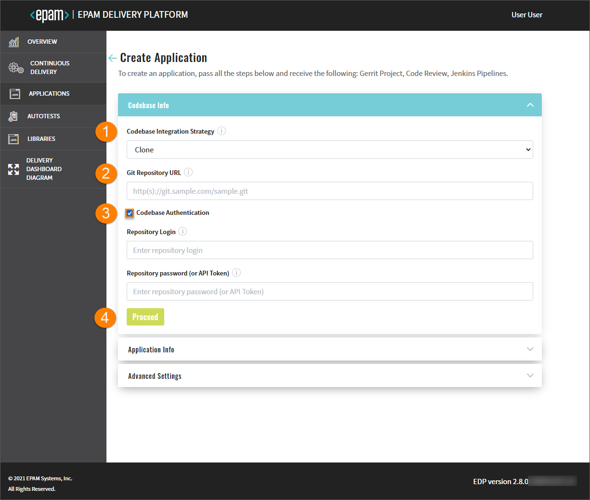
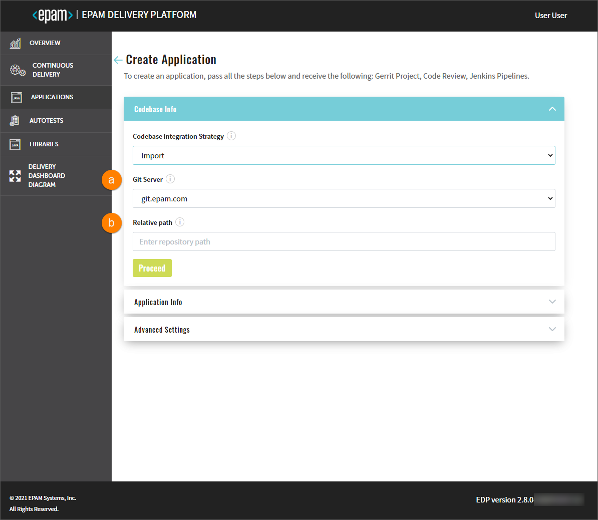
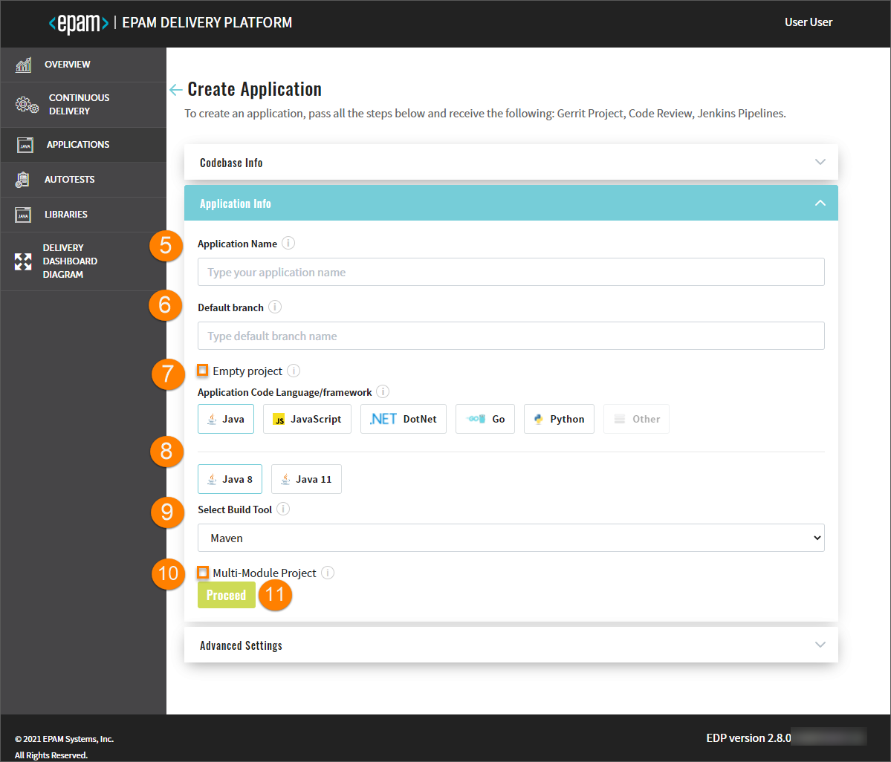
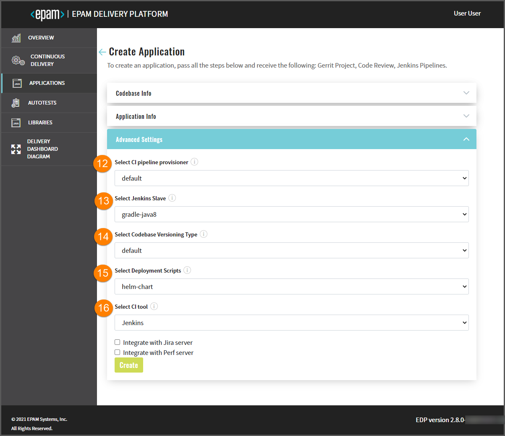
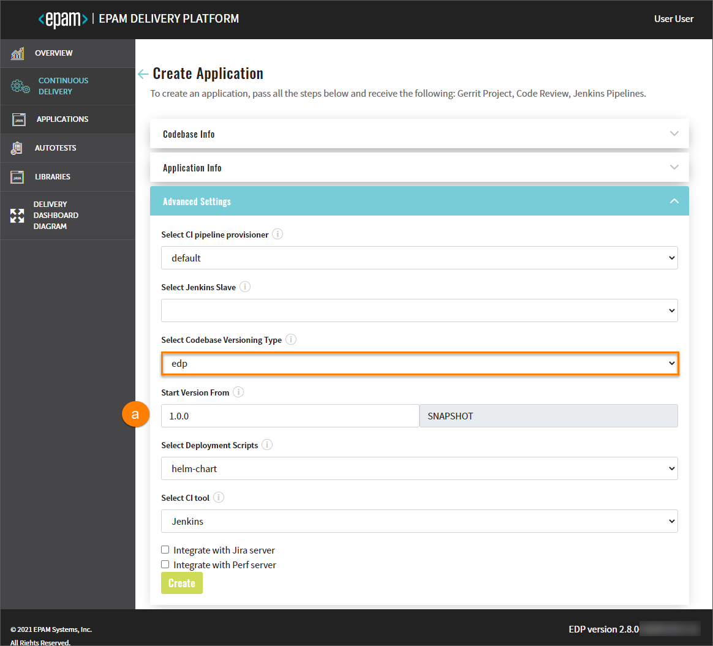
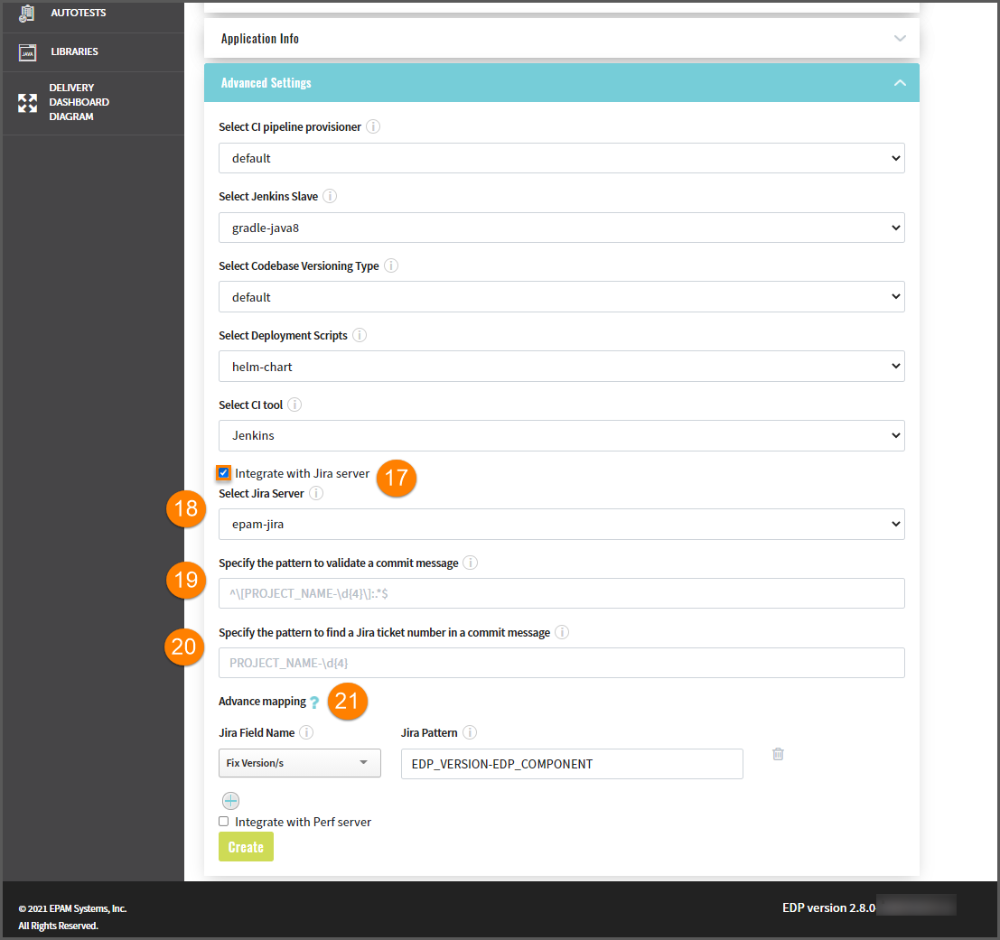
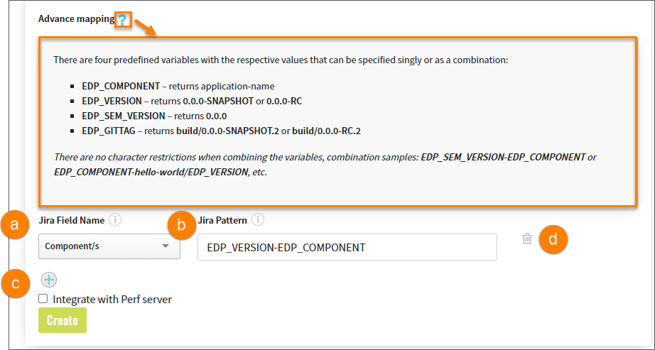
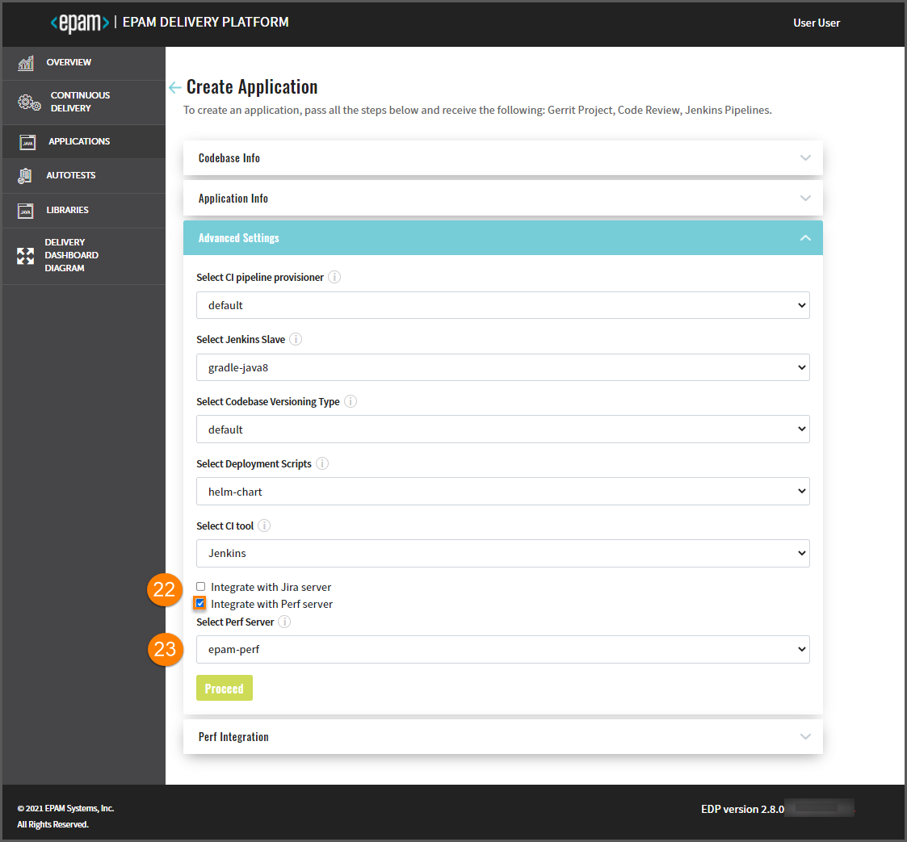
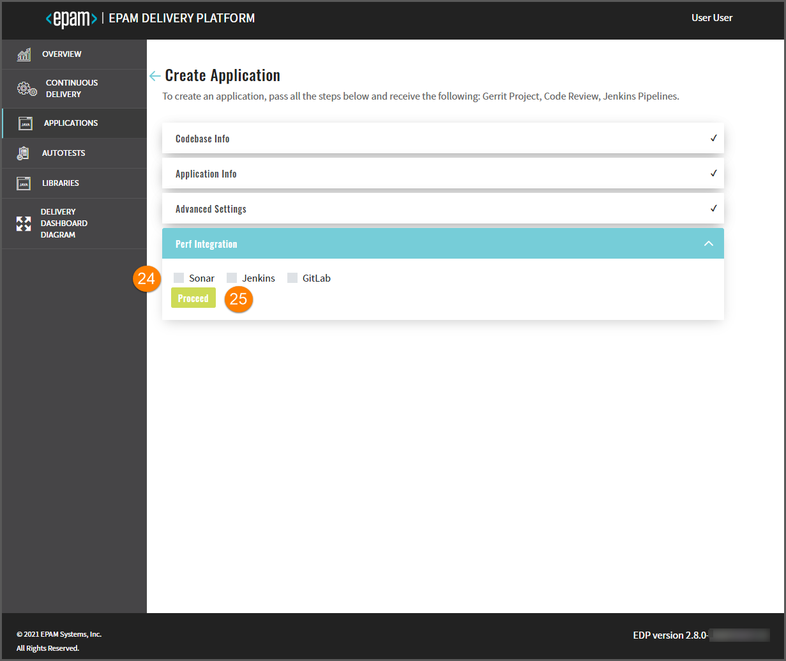
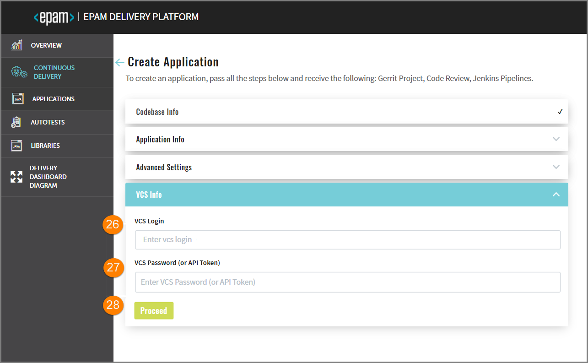

# Add Applications

Admin Console allows to create, clone, import an application and add it to the environment with its subsequent
deployment
in Gerrit and building of the Code Review and Build pipelines in Jenkins.

To add an application, navigate to the **Applications** section on the left-side navigation bar and click the Create
button.

Once clicked, the four-step menu will appear:

* The Codebase Info Menu
* The Application Info Menu
* The Advanced Settings Menu
* The Version Control System Info Menu

>_**NOTE**: The Version Control System Info menu is available in case this option is predefined._

## The Codebase Info Menu

   

1. In the **Codebase Integration Strategy** field, select the necessary option that is the configuration strategy
for the replication with Gerrit:
    - Create – creates a project on the pattern in accordance with an application language, a build tool,
    and a framework.
    - Clone – clones the indicated repository into EPAM Delivery Platform. While cloning the existing repository,
    you have to fill in the additional fields as well.
    - Import - allows configuring a replication from the Git server. While importing the existing repository,
    you have to select the Git server and define the respective path to the repository.
   >_**NOTE**: In order to use the import strategy, make sure to adjust it by following
   the [Adjust Import Strategy](../documentation/import-strategy.md) page._

2. In the **Git Repository URL** field, specify the link to the repository that is to be cloned.
If the Import strategy is selected, specify the following fields:

     

   a. Git Server where the repository is located.

   b. Relative path to the repository on the server.
   
3. Select the **Codebase Authentication** check box and fill in the requested fields:
    - Repository Login – enter your login data.
    - Repository password (or API Token) – enter your password or indicate the API Token.

   >_**NOTE**: The Codebase Authentication check box should be selected only in case you clone the private repository.
   If you define the public one, there is no need to enter credentials._

4. Click the Proceed button to be switched to the next menu.
    
    ## The Application Info Menu
    
   
   
5. Type the name of the application in the **Application Name** field by entering at least two characters
and by using the lower-case letters, numbers and inner dashes.

6. Specify the name of the default branch where you want the development to be performed.
    >_**NOTE**: The default branch cannot be deleted._

7. To create an application with an empty repository in Gerrit, select the **Empty project** checkbox.

    >_**NOTE**: The empty repository option is available only for the **Create** strategy._

8. Select any of the supported application languages with its framework
in the **Application Code Language/framework** field:

    - Java – selecting Java allows using Java 8 or Java 11.
    - JavaScript - selecting JavaScript allows using the React framework.
    - DotNet - selecting DotNet allows using the DotNet v.2.1 and DotNet v.3.1.
    - Go - selecting Go allows using the Beego and Operator SDK frameworks.
    - Python - selecting Python allows using the Python v.3.8.
    - Other - selecting Other allows extending the default code languages when creating a codebase
    with the clone/import strategy. To add another code language,
    inspect the [Add Other Code Language](add_other_code_language.md) section.

    >_**NOTE**: The Create strategy does not allow to customize the default code language set._

9. Choose the necessary build tool in the Select Build Tool field:

    - Java - selecting Java allows using the Gradle or Maven tool.
    - JavaScript - selecting JavaScript allows using the NPM tool.
    - .Net - selecting .Net allows using the .Net tool.

    >_**NOTE**: The Select Build Tool field disposes of the default tools and can be changed
    in accordance with the selected code language._

10. Select the **Multi-Module Project** check box that becomes available
if the Java code language and the Maven build tool are selected.

11. Click the Proceed button to be switched to the next menu.
    
    ## The Advanced Settings Menu

    

12. Select CI pipeline provisioner that will be handling a codebase. For details, refer to the
[Add Job Provision](https://github.com/epam/edp-jenkins-operator/blob/master/documentation/add-job-provision.md#add-job-provision)
instruction and become familiar with the main steps to add an additional job provisioner.
13. Select Jenkins slave that will be used to handle a codebase. For details, refer to the
[Add Jenkins Slave](https://github.com/epam/edp-jenkins-operator/blob/master/documentation/add-jenkins-slave.md#add-jenkins-slave)
instruction and inspect the steps that should be done to add a new Jenkins slave.
14. Select the necessary codebase versioning type:

     * **default** - the previous versioning logic that is realized in EDP Admin Console 2.2.0 and lower versions.
     Using the default versioning type, in order to specify the version of the current artifacts, images,
     and tags in the Version Control System, a developer should navigate to the corresponding file
     and change the version **manually**.

     * **edp** - the new versioning logic that is available in EDP Admin Console 2.3.0 and subsequent versions.
     Using the edp versioning type, a developer indicates the version number from which all the artifacts
     will be versioned and, as a result, **automatically** registered in the corresponding file (e.g. pom.xml).

       When selecting the edp versioning type, the extra field will appear:

       
       
       a. Type the version number from which you want the artifacts to be versioned.

     >_**NOTE**: The Start Version From field should be filled out in compliance with the semantic versioning rules,
     e.g. 1.2.3 or 10.10.10._

15. In the **Select Deployment Script** field, specify one of the available options:
helm-chart / openshift-template that are predefined in case it is OpenShift or EKS.

16. In the **Select CI Tool** field, choose the necessary tool: Jenkins or GitLab CI,
where Jenkins is the default tool and
the GitLab CI tool can be additionally adjusted. For details,
please refer to the [Adjust GitLab CI Tool](../documentation/ci-tool.md) page.

    >_**NOTE**: The GitLab CI tool is available only with the Import strategy
    and makes the **Jira integration** feature unavailable._
                                                                                                                                                                                                                                                                  
    
17. Select the **Integrate with Jira Server** checkbox in case it is required to connect Jira tickets with the commits
and have a respective label in the Fix Version field.
    >_**NOTE**: To adjust the Jira integration functionality, first apply the necessary changes described
    on the [Adjust Integration With Jira Server](../documentation/jira-server.md) page,
    and setup the [VCS Integration With Jira Server](../documentation/jira_vcs_integration.md).
    Pay attention that the Jira integration feature is not available when using the GitLab CI tool._

18. In the **Select Jira Server** field, select the Jira server.
19. Indicate the pattern using any character, which is followed on the project, to validate a commit message.
20. Indicate the pattern using any character, which is followed on the project, to find a Jira ticket number
in a commit message.
21. In the **Advanced Mapping** section, specify the names of the Jira fields that should be filled in with attributes
from EDP. Upon clicking the question mark icon, observe the tips on how to indicate and combine variables necessary
for identifying the format of values to be displayed.

     

    a. Select the name of the field in a Jira ticket. The available fields are the following: **Fix Version/s**,
    **Component/s** and **Labels**.

    b. Select the pattern of predefined variables, based on which the value from EDP will be displayed in Jira.
    Combine several variables to obtain the desired value.

    - For the **Fix Version/s** field, select the **EDP_VERSION** variable that represents an EDP upgrade version,
    as in _2.7.0-SNAPSHOT_. Combine variables to make the value more informative. For example,
    the pattern **EDP_VERSION-EDP_COMPONENT** will be displayed as _2.7.0-SNAPSHOT-nexus-operator_ in Jira;
    - For the **Component/s** field, select the **EDP_COMPONENT** variable that defines the name of the existing
    repository. For example, _nexus-operator_;
    - For the **Labels** field, select the **EDP_GITTAG** variable that defines a tag assigned to the commit in GitHub.
    For example, _build/2.7.0-SNAPSHOT.59_.

    c. Click the plus icon to add more Jira field names.

    d. Click the delete icon to remove the Jira field name.

    

22. Select the **Integrate with Perf Server** checkbox in case it is required to connect
to the [PERF Board](https://kb.epam.com/display/EPMDMO/Project+Performance+Board) (_Project Performance Board_).
Such functionality allows monitoring the overall team performance and setting up necessary metrics.

    >_**NOTE**: To adjust the Perf Server integration functionality, first deploy Perf Operator.
    To get more information about the Perf Operator installation and architecture, please refer
    to the [PERF Operator](https://github.com/epam/edp-perf-operator#perf-operator) page._

23. In the **Select Perf Server** field, select the name of the Perf server with which the integration should be
performed. Click the Proceed button to be switched to the next menu.

    

24. Select the necessary DataSource (_Jenkins, Sonar, GitLab_) from which the data should be transferred
to the Project Performance Board.
25. Click the Proceed button to be switched to the next menu.

    ## The Version Control System Info Menu

    

26. Enter the login credentials into the **VCS Login** field.
27. Enter the password into the **VCS Password (or API Token)** field OR add the API Token.
Click the Proceed button to be switched to the next menu.
   
    >_**NOTE**: The VCS Info step is skipped in case there is no need to integrate the version control
    for the application deployment. If the cloned application includes the VCS, this step should be completed as well._
28. Click the Proceed button. Once clicked, the CONFIRMATION summary will appear displaying all the specified options
and settings, click Continue to complete the application addition.

>_**NOTE**: After the complete adding of the application,
please refer to the [Inspect Application](../documentation/inspect_application.md) page._

### Related Articles

* [Inspect Application](../documentation/inspect_application.md)
* [Delivery Dashboard Diagram](../documentation/d_d_diagram.md)
---
* [Add CD Pipelines](../documentation/add_CD_pipelines.md)
* [Add Jenkins Slave](https://github.com/epam/edp-jenkins-operator/blob/master/documentation/add-jenkins-slave.md#add-jenkins-slave)
* [Add Job Provision](https://github.com/epam/edp-jenkins-operator/blob/master/documentation/add-job-provision.md#add-job-provision)
* [Add Other Code Language](../documentation/add_other_code_language.md)
* [Adjust GitLab CI Tool](../documentation/ci-tool.md)
* [Adjust Import Strategy](../documentation/import-strategy.md)
* [Adjust Integration With Jira Server](../documentation/jira-server.md)
* [Adjust VCS Integration With Jira Server](../documentation/jira_vcs_integration.md)
