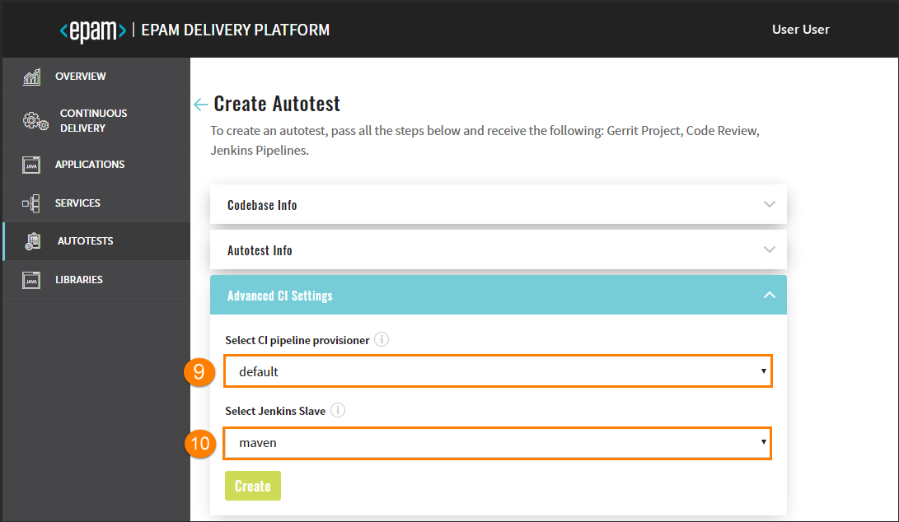

# Add Autotests

Admin Console enables to clone or import an autotest and add it to the environment with its subsequent deployment in Gerrit and building of the Code Review pipeline in Jenkins. 

Navigate to the **Autotests** section on the left-side navigation bar and click the Create button.

Once clicked, the four-step menu will appear:

* The Codebase Info Menu 
* The Autotest Info Menu
* The Advanced CI Settings Menu
* The Version Control System Info Menu

After the complete adding of the autotest, inspect the [Check Autotest Availability](##Check Autotest Availability) part.

# The Codebase Info Menu 

There are two available strategies: clone and import. The Clone strategy flow is displayed below:

1. **Clone** - this strategy allows cloning the autotest from the indicated repository into EPAM Delivery Platform. While cloning the existing repository, you have to fill in the additional fields as well.
2. In the **Git Repository URL** field, specify the link to the repository with the autotest.
3. Select the **Codebase Authentication** check box and fill in the requested fields:
    - Repository Login – enter your login data.
    - Repository password (or API Token) – enter your password or indicate the API Token.

    If there is a necessity to use the **Import** strategy that allows configuring a replication from the Git server, explore the steps below:

    

    a. Import - this strategy allows configuring a replication from the Git server.

    b. In the **Git Server** field, select the necessary Git server from the drop-down list.

    c. In the Relative path field, indicate the respective path to the repository, e.g. **/epmd-edp/examples/basic/edp-auto-tests-simple-example**.

4. After completing the Codebase Info menu step, click the Proceed button to be switched to the next menu.

    ## The Autotest Info Menu

    
 
5. Fill in the **Autotest Name** field by entering at least two characters and by using the lower-case letters, numbers and inner dashes. Type the necessary description in the **Description** field as well.

    _**INFO**: The Import strategy does not have an Autotest Name field._

6. In the **Autotest Code Language** field, select the Java code language and get the default Maven build tool OR add another code language. Selecting **Other** allows extending the default code languages and get the necessary build tool, for details, inspect the [Add Other Code Language](add_other_code_language.md) section.

7. The **Select Build Tool** field can dispose of the default Maven tool or can be changed in accordance with the selected code language.

8. All the autotest reports will be created in the Allure framework that is available In the **Autotest Report Framework** field by default. Click the Proceed button to be switched to the next menu.

    ## The Advanced CI Settings Menu

    

9. Select job provisioner that will be used to handle a codebase. For details, refer to the [Add Job Provision](https://github.com/epmd-edp/jenkins-operator/blob/master/documentation/add-job-provision.md#add-job-provision) instruction and become familiar with the main steps to add an additional job provisioner.

10. Select Jenkins slave that will be used to handle a codebase. For details, refer to the [Add Jenkins Slave](https://github.com/epmd-edp/jenkins-operator/blob/master/documentation/add-jenkins-slave.md#add-jenkins-slave) instruction and inspect the steps that should be done to add a new Jenkins slave.

    _**INFO**: Click the Create button to create an autotest or click the Proceed button to be switched to the next VCS menu that can be predefined._ 

    ## The Version Control System Info Menu

    Once navigated to the VCS Info menu, perform the following:
    
    

11. Enter the login credentials into the **VCS Login** field.

12. Enter the password into the **VCS Password (or API Token)** field OR add the API Token.

13. Click the Create button, check the CONFIRMATION summary, click Continue to add an autotest to the Autotests list. 

## Check Autotest Availability

As soon as the autotest is added, it will be available in the Autotests list where it is possible to click its name and get access to the following:  

1. General Info - displays the common information about the cloned autotest.
2. Advanced CI Settings - displays the specified job provisioner and Jenkins slave.
3. Branches - displays the status and name of the deployment branch, keeps the additional links to Jenkins and Gerrit.

    The **master** branch is the default one but you can create a new branch as well. To do this, perform the steps:
    - Click the Create button;
    - Fill in the required fields by typing the branch name and pasting the copied commit hash;
    - Click the Proceed button and wait until the new branch will be added to the list.

    _**NOTE**: To copy the commit hash, click the VCS link and select the necessary commit._
4. Status Info - displays all the actions that were performed during the cloning process.