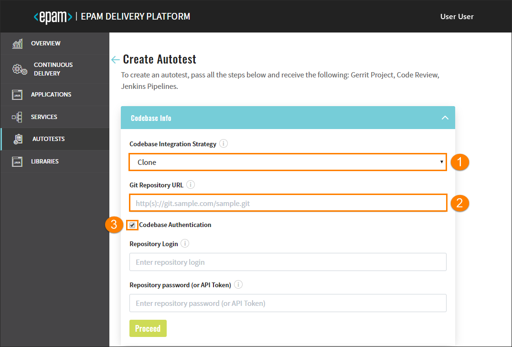
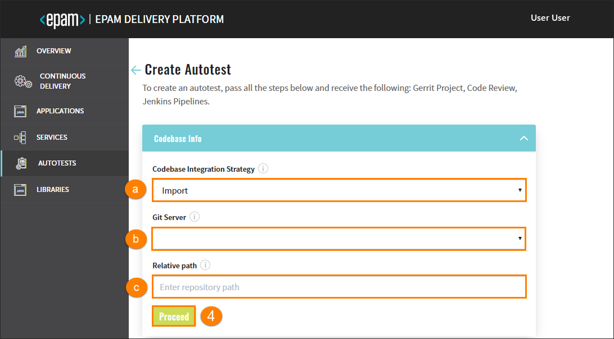
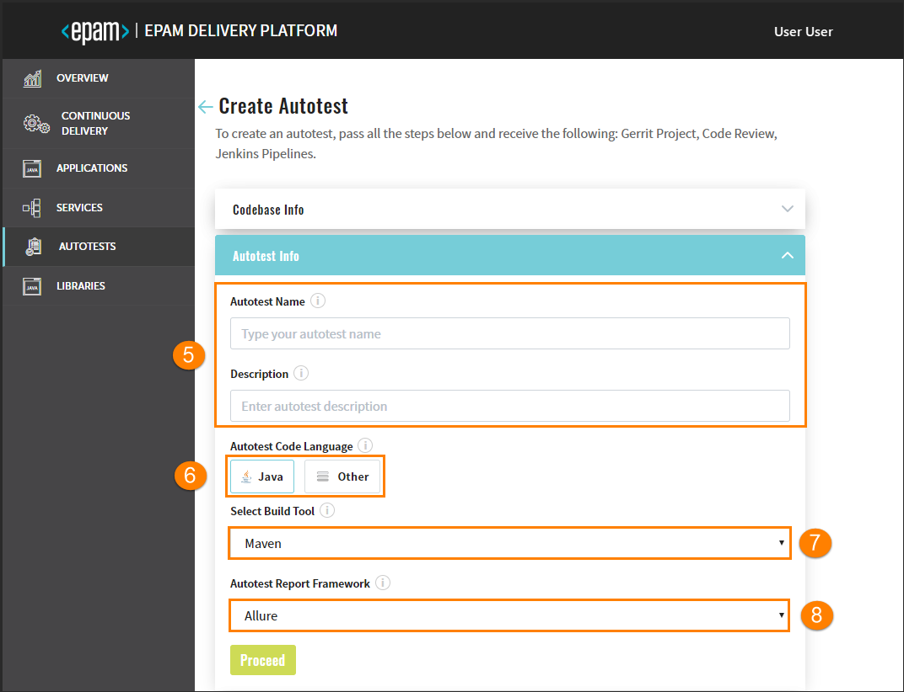
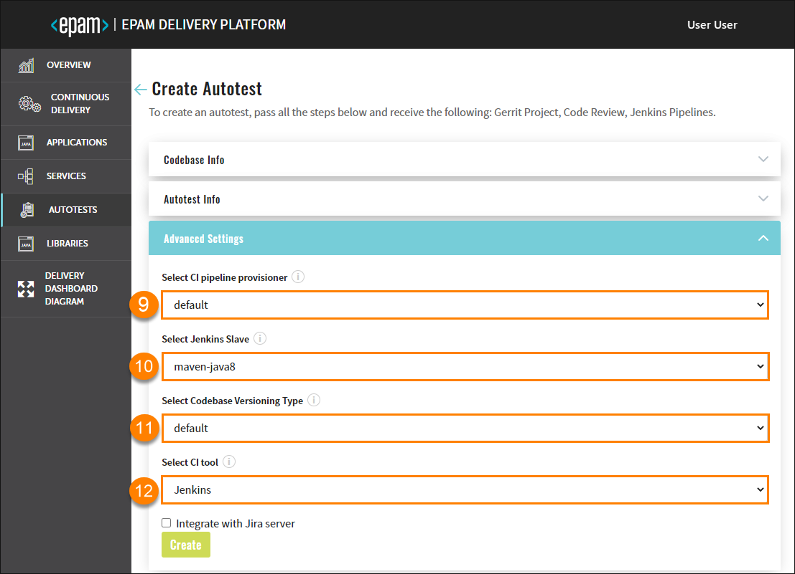
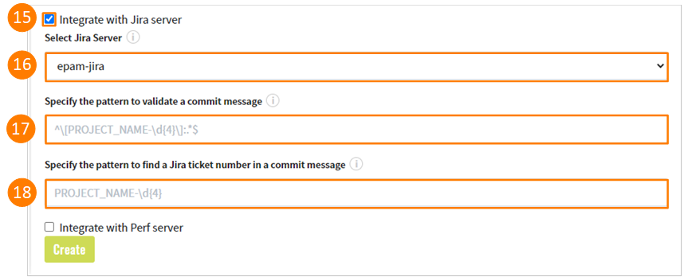
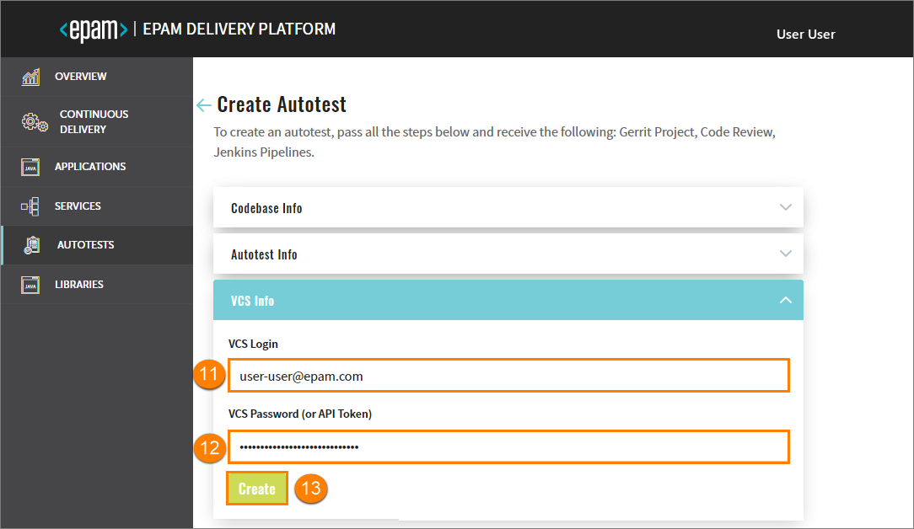

# Add Autotests

Admin Console enables to clone or import an autotest and add it to the environment with its subsequent deployment in Gerrit and building of the Code Review pipeline in Jenkins. 

Navigate to the **Autotests** section on the left-side navigation bar and click the Create button.

Once clicked, the four-step menu will appear:

* The Codebase Info Menu 
* The Autotest Info Menu
* The Advanced Settings Menu
* The Version Control System Info Menu

## The Codebase Info Menu 

There are two available strategies: clone and import. The Clone strategy flow is displayed below:

1. **Clone** - this strategy allows cloning the autotest from the indicated repository into EPAM Delivery Platform. While cloning the existing repository, you have to fill in the additional fields as well.
2. In the **Git Repository URL** field, specify the link to the repository with the autotest.
3. Select the **Codebase Authentication** check box and fill in the requested fields:
    - Repository Login – enter your login data.
    - Repository password (or API Token) – enter your password or indicate the API Token.

    If there is a necessity to use the **Import** strategy that allows configuring a replication from the Git server, explore the steps below:

    

    a. Import - this strategy allows configuring a replication from the Git server.
    >_**NOTE**: In order to use the import strategy, make sure to adjust it by following the [Adjust Import Strategy](../documentation/import-strategy.md) page._
    
    b. In the **Git Server** field, select the necessary Git server from the drop-down list.

    c. In the Relative path field, indicate the respective path to the repository, e.g. **/epmd-edp/examples/basic/edp-auto-tests-simple-example**.

4. After completing the Codebase Info menu step, click the Proceed button to be switched to the next menu.

    ## The Autotest Info Menu

    
 
5. Fill in the **Autotest Name** field by entering at least two characters and by using the lower-case letters, numbers and inner dashes. Type the necessary description in the **Description** field as well.

    _**INFO**: The Import strategy does not have an Autotest Name field._

6. In the **Autotest Code Language** field, select the Java code language (specify Java 8 or Java 11 to be used) and get the default Maven build tool OR add another code language. Selecting **Other** allows extending the default code languages and get the necessary build tool, for details, inspect the [Add Other Code Language](add_other_code_language.md) section.

7. The **Select Build Tool** field can dispose of the default Maven tool or can be changed in accordance with the selected code language.

8. All the autotest reports will be created in the Allure framework that is available In the **Autotest Report Framework** field by default. Click the Proceed button to be switched to the next menu.

    ## The Advanced Settings Menu

    

9. Select CI pipeline provisioner that will be used to handle a codebase. For details, refer to the [Add Job Provision](https://github.com/epmd-edp/jenkins-operator/blob/master/documentation/add-job-provision.md#add-job-provision) instruction and become familiar with the main steps to add an additional job provisioner.

10. Select Jenkins slave that will be used to handle a codebase. For details, refer to the [Add Jenkins Slave](https://github.com/epmd-edp/jenkins-operator/blob/master/documentation/add-jenkins-slave.md#add-jenkins-slave) instruction and inspect the steps that should be done to add a new Jenkins slave.

11. Select the necessary codebase versioning type:
         
    * **default** - the previous versioning logic that is realized in EDP Admin Console 2.2.0 and lower versions. Using the default versioning type, in order to specify the version of the current artifacts, images, and tags in the Version Control System, a developer should navigate to the corresponding file and change the version **manually**.
          
    * **edp** - the new versioning logic that is available in EDP Admin Console 2.3.0 and subsequent versions. Using the edp versioning type, a developer indicates the version number from which all the artifacts will be versioned and, as a result, **automatically** registered in the corresponding file (e.g. pom.xml). 
         
      When selecting the edp versioning type, the extra field will appear:
             
      
         
      a. Type the version number from which you want the artifacts to be versioned.
         
    _**NOTE**: The Start Version From field should be filled out in compliance with the semantic versioning rules, e.g. 1.2.3 or 10.10.10._
12. In the **Select CI Tool** field, choose the necessary tool: Jenkins or GitLab CI, where Jenkins is the default tool and
    the GitLab CI tool can be additionally adjusted. For details, please refer to the [Adjust GitLab CI Tool](../documentation/ci-tool.md) page.
       >_**NOTE**: The GitLab CI tool is available only with the Import strategy and makes the **Jira integration** feature unavailable._    

13. Select the **Integrate with Jira Server** checkbox in case it is required to connect Jira tickets with the commits and have a respective label in the Fix Version field.
       >_**NOTE**: To adjust the Jira integration functionality, first apply the necessary changes described on the [Adjust Integration With Jira Server](../documentation/jira-server.md) page, and setup the [VCS Integration With Jira Server](../documentation/jira_vcs_integration.md). Pay attention that the Jira integration feature is not available when using the GitLab CI tool._ 
    
       
14. As soon as the Jira server is set, select it in the **Select Jira Server** field.
15. Indicate the pattern using any character, which is followed on the project, to validate a commit message.
16. Indicate the pattern using any character, which is followed on the project, to find a Jira ticket number in a commit message.
17. Click the Create button to create an autotest or click the Proceed button to be switched to the next VCS menu that can be predefined.
    ## The Version Control System Info Menu

    Once navigated to the VCS Info menu, perform the following:
    
    

18. Enter the login credentials into the **VCS Login** field.

19. Enter the password into the **VCS Password (or API Token)** field OR add the API Token.

20. Click the Create button, check the CONFIRMATION summary, click Continue to add an autotest to the Autotests list. 

>_**NOTE**: After the complete adding of the autotest, inspect the [Inspect Autotest](../documentation/inspect_autotest.md) part._

### Related Articles

* [Inspect Autotest](../documentation/inspect_autotest.md)
* [Delivery Dashboard Diagram](../documentation/d_d_diagram.md)
---
* [Add CD Pipelines](../documentation/add_CD_pipelines.md)
* [Adjust Integration With Jira Server](../documentation/jira-server.md)
* [Adjust VCS Integration With Jira Server](../documentation/jira_vcs_integration.md)