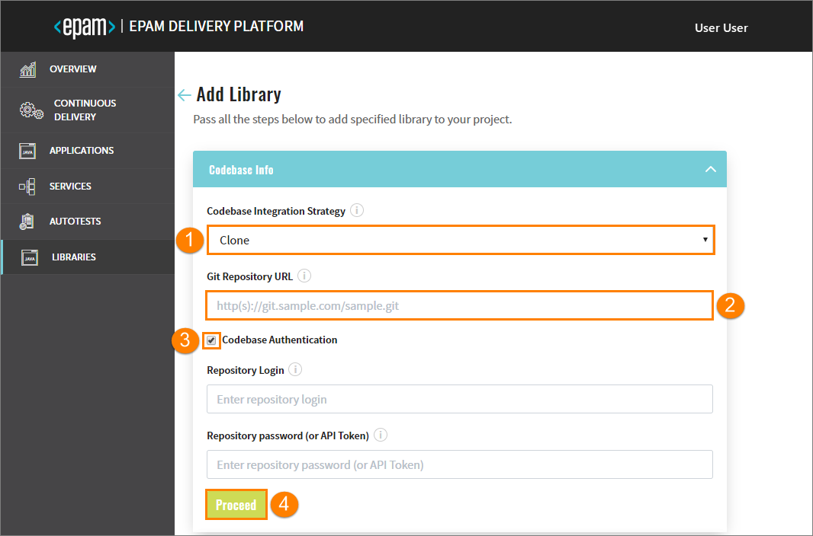
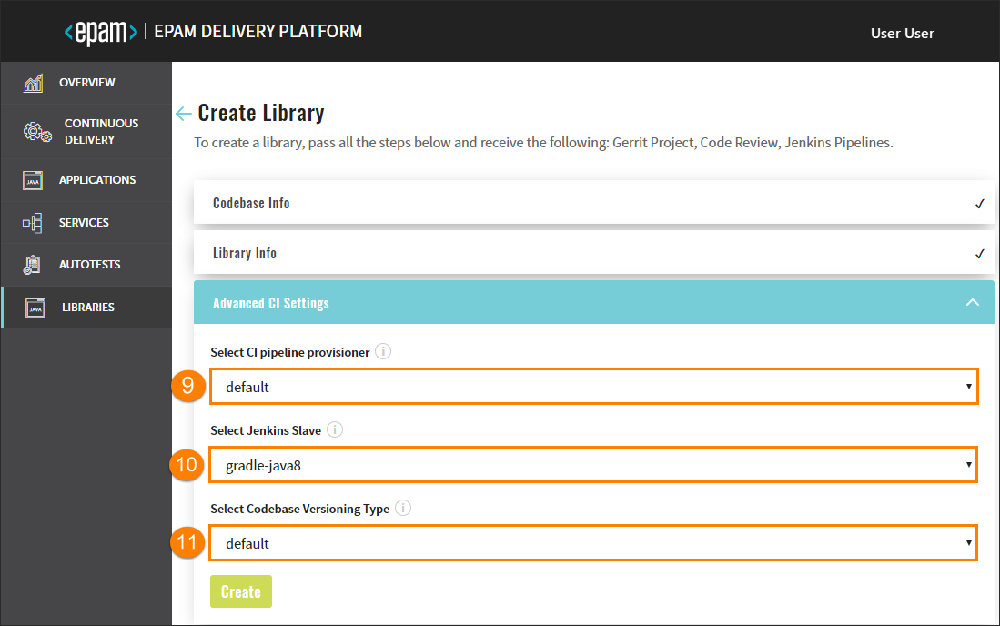

# Add Libraries

Admin Console helps to create, clone or import a library and add it to the environment with its subsequent deployment in Gerrit and building of the Code Review and Build pipelines in Jenkins. 

Navigate to the **Libraries** section on the left-side navigation bar and click the Create button.

Once clicked, the four-step menu will appear:

* The Codebase Info Menu
* The Library Info Menu
* The Advanced CI Settings Menu
* The Version Control System Info Menu

_**NOTE**: The Version Control System Info menu is available in case this option is predefined._

After the complete adding of the library, inspect the [Check Library Availability](#Check_Library_Availability) part.

## The Codebase Info Menu

1. In the **Codebase Integration Strategy** field, select the necessary option that is the configuration strategy for the replication with Gerrit:
    - Create – creates a project on the pattern in accordance with a code language, a build tool, and a framework.
    - Clone – clones the indicated repository into EPAM Delivery Platform.
    - Import - allows configuring a replication from the Git server. While importing the existing repository, you have to select the Git server and define the respective path to the repository.

    _**NOTE**: While cloning the existing repository, you have to fill in the additional fields as well._

2. In the **Git Repository URL** field, specify the link to the repository that is to be cloned.
3. Select the **Codebase Authentication** check box and fill in the requested fields:
    - Repository Login – enter your login data.
    - Repository password (or API Token) – enter your password or indicate the API Token.
4. Click the Proceed button to be switched to the next menu.

    ## The Library Info Menu

    

5. Type the name of the library in the **Library Name** field by entering at least two characters and by using the lower-case letters, numbers and inner dashes.

    _**INFO**: If the Import strategy is used, the Library Name field will not be displayed._

6. Select any of the supported code languages in the **Library Code Language** block:

    - Java – selecting Java allows using the Gradle or Maven tool.
    - JavaScript - selecting JavaScript allows using the NPM tool.
    - .Net - selecting .Net allows using the .Net tool.
    - Groovy-pipeline - selecting Groovy-pipeline allows having the ability to customize a stages logic. For details, please refer to the [Customize CD Pipeline](https://github.com/epmd-edp/jenkins-operator/blob/master/documentation/customize-deploy-pipeline.md#customize-cd-pipeline) page.
    - Other - selecting Other allows extending the default code languages when creating a codebase with the clone/import strategy. To add another code language, inspect the [Add Other Code Language](https://github.com/epmd-edp/admin-console/blob/master/readme.md#add-other-code-language) page.

    _**NOTE**: The Create strategy does not allow to customize the default code language set._

7. The **Select Build Tool** field disposes of the default tools and can be changed in accordance with the selected code language.

8. Click the Proceed button to be switched to the next menu.

    ## The Advanced CI Settings Menu
    
    

9. Select job provisioner that will be used to handle a codebase. For details, refer to the [Add Job Provision](https://github.com/epmd-edp/jenkins-operator/blob/master/documentation/add-job-provision.md#add-job-provision) instruction and become familiar with the main steps to add an additional job provisioner.

10. Select Jenkins slave that will be used to handle a codebase. For details, refer to the [Add Jenkins Slave](https://github.com/epmd-edp/jenkins-operator/blob/master/documentation/add-jenkins-slave.md#add-jenkins-slave) instruction and inspect the steps that should be done to add a new Jenkins slave.

    _**INFO**: Click the Create button to create an autotest or click the Proceed button to be switched to the next VCS menu that can be predefined._ 

    ## The Version Control System Info Menu

    

11. Enter the login credentials into the **VCS Login** field.
12. Enter the password into the **VCS Password (or API Token)** field OR add the API Token.
13. Click the Create button, check the CONFIRMATION summary, click Continue to add the library to the Libraries list.

##  Check Library Availability

Once you add all the necessary libraries performing the same steps as described above, they appear in the Library list. Click the library name to open the following:

1. General Info - displays common information about the created or cloned library.
2. Advanced CI Settings - displays the specified job provisioner and Jenkins slave.
3. Branches - displays the status and name of the deployment branch, keeps the additional links to Jenkins and Gerrit.

    The **master** branch is the default one but you can create a new branch as well. To do this, perform the steps:

    - Click the Create button;
    - Fill in the required fields by typing the branch name and pasting the copied commit hash;
    - Click the Proceed button and wait until the new branch will be added to the list.
   
    _**NOTE**:To copy the commit hash, click the VCS link and select the necessary commit._  
4. Status Info - displays all the actions that were performed during the creating/cloning process.