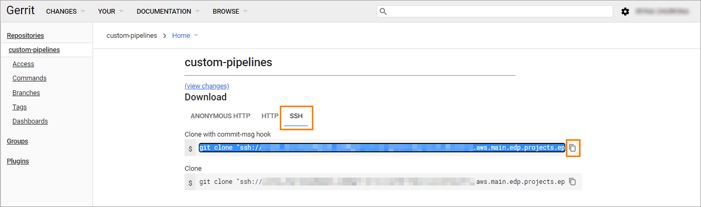
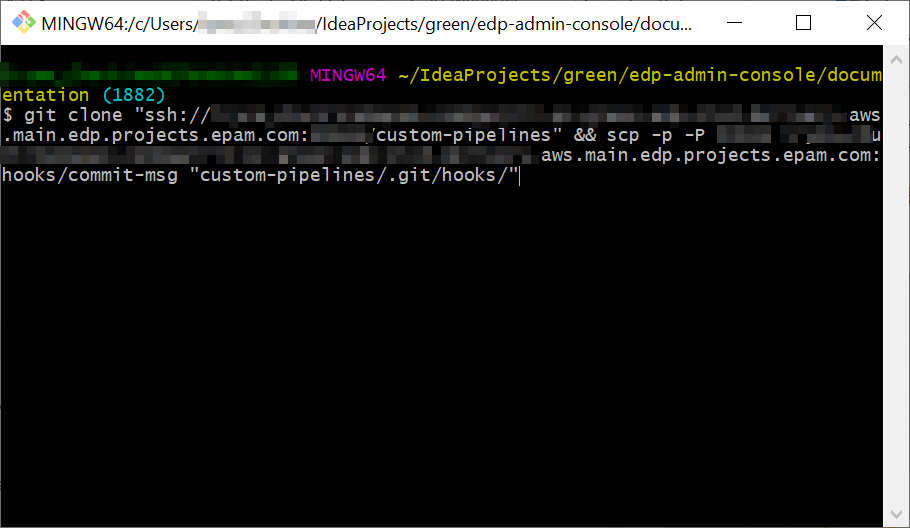

# Clone Project via Git Bash Terminal

To clone the project/repository using Git Bash, follow the steps below:

1. Being in Gerrit, open the necessary project/repository, pay attention to have the SSH tab selected, and click the copy icon:
    
    
2. Open the Git Bash terminal and process the copied commands (SHIFT+Insert): 
    
    
3. As a result, the project will be cloned, thus allowing creating changes. 

### Related Articles

* [EDP Admin Console](https://github.com/epmd-edp/admin-console/tree/master#edp-admin-console)
* [Creating a Change in Gerrit](https://charm.cs.illinois.edu/gerrit/Documentation/user-inline-edit.html#create-change)