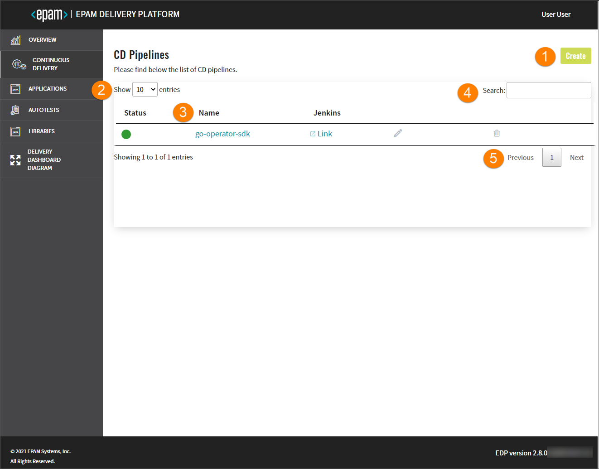
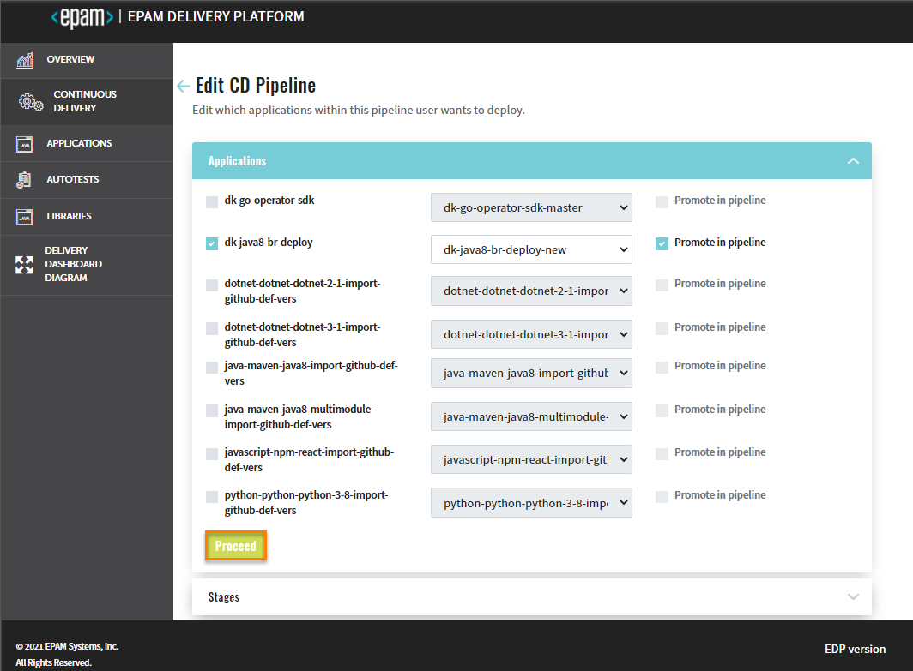
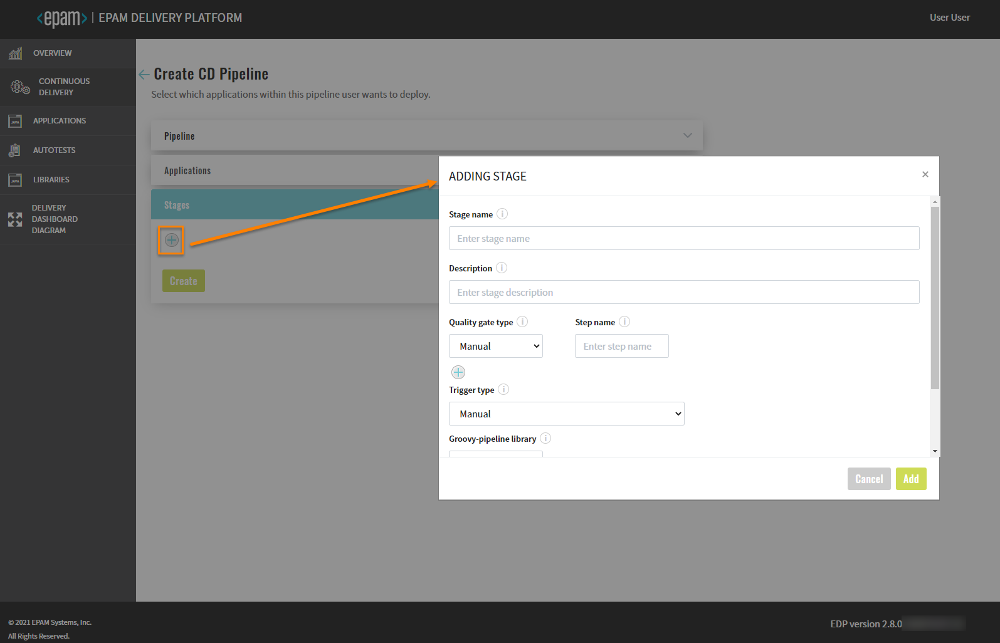
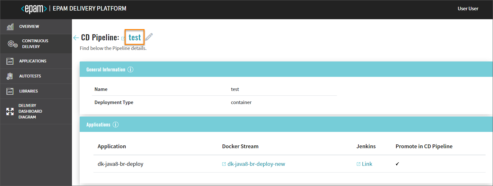
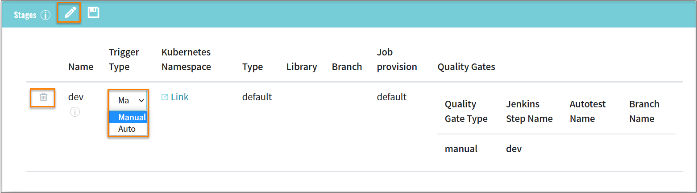
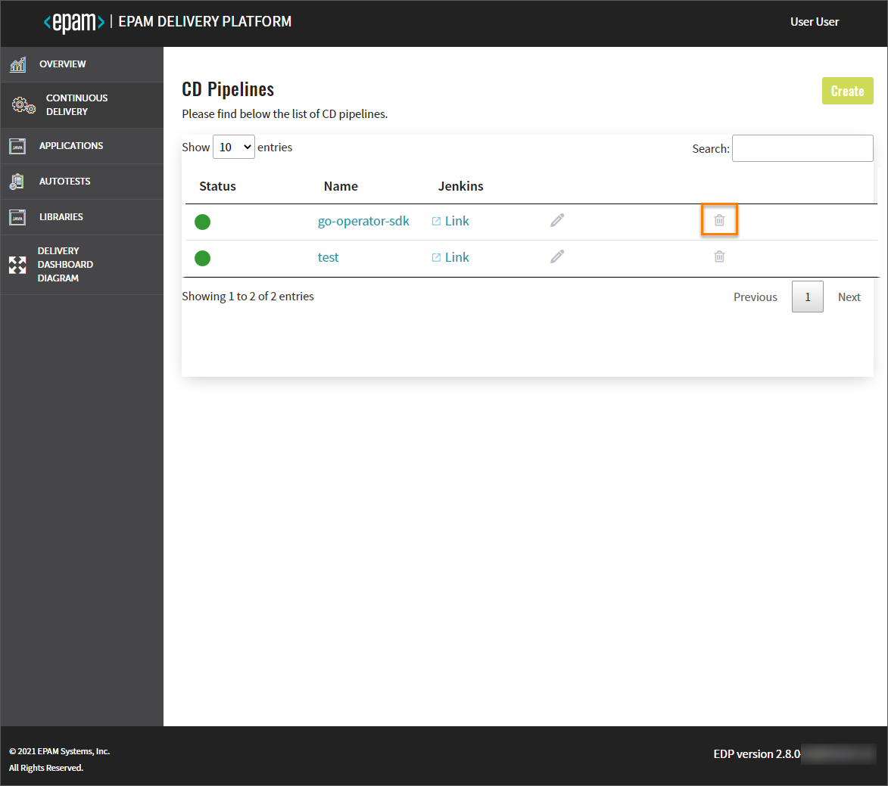

# Inspect CD Pipeline

This section describes the subsequent possible actions that can be performed with the newly added or existing CD pipelines.

## Check CD Pipeline Availability

As soon as the CD pipeline is provisioned and added to the CD Pipelines list, there is an ability to:
    
   

1. Create another application by clicking the Create button and performing the same steps as described
at the [Add CD Pipeline](../documentation/add_CD_pipelines.md) page.
2. Select a number of existing CD pipelines to be displayed on one page in the **Show entries** field.
The filter allows to show 10, 25, 50 or 100 entries per page.
3. Sort the existing CD pipelines in a list by clicking the Name title.
The CD pipelines will be displayed in alphabetical order.
4. Search the necessary CD pipeline by entering the corresponding name, language or the build tool into
the **Search** field.
5. Navigate between pages if the number of CD pipelines exceeds the capacity of a single page.

## Edit CD Pipeline

-  Edit the CD pipeline by clicking the pen icon next to its name in the CD Pipelines list:

    

    - apply the necessary changes and click the Proceed button to confirm the editions:

    
    
    - add new extra stages steps by clicking the plus sign icon and filling in the necessary fields
    in the Adding Stage window.
    
    
   >_**NOTE**: Please refer to the [Add CD Pipelines](../documentation/add_CD_pipelines.md) for details._ 
       
   
     
   >_**NOTE**: The added stage will appear in the Stages menu allowing to review its details or delete._
- Check the CD pipeline data and details by clicking the CD pipeline name in the CD Pipelines list:

     

    - the main link on the top of the details page refers to Jenkins;
    
    
    
    - the pen icon refers to the same **Edit CD Pipeline** page as mentioned above and allows to apply the necessary
    changes;
        
    - the General Information menu reveals the pipeline name and the deployment type of the application;

    - the Applications menu has the main information about the applications with the respective codebase Docker streams
    and links to Jenkins and Gerrit as well as the signification of the promotion in CD pipeline;
      
   - the Stages menu includes the stages data that was previously mentioned, the direct links to the respective
    to every stage OpenShift page, and the link to the Autotest details page in case there are added autotests.
    To enable or disable auto deployment of a specific stage, click the pen icon and select the necessary trigger type
    from the drop-down list. 
    
    
    
    >_**NOTE**: The deletion of stages is performed sequentially, starting from the latest created stage.
      In order to **remove a stage**, click the corresponding delete icon, type the CD pipeline name
      and confirm the deletion by clicking the Delete button. If you remove the last stage,
      the whole CD pipeline will be removed as the CD pipeline does not exist without stages._
        

   - the Deployed Version menu indicates the applications and stages with the appropriate status.
    The status will be changed after stage deployment.

   

   - the Status Info menu displays all the actions that were performed during the deployment process:
    
   
   
-  Remove the added CD pipeline:

    

>_**INFO**: If there is a necessity to create another CD pipeline, navigate to the Continuous Delivery section,
click the Create button and perform the same steps as described above._

### Related Articles

* [Add CD Pipelines](../documentation/add_CD_pipelines.md)
* [EDP Admin Console](https://github.com/epam/edp-admin-console#edp-admin-console)
* [Delivery Dashboard Diagram](../documentation/d_d_diagram.md)

