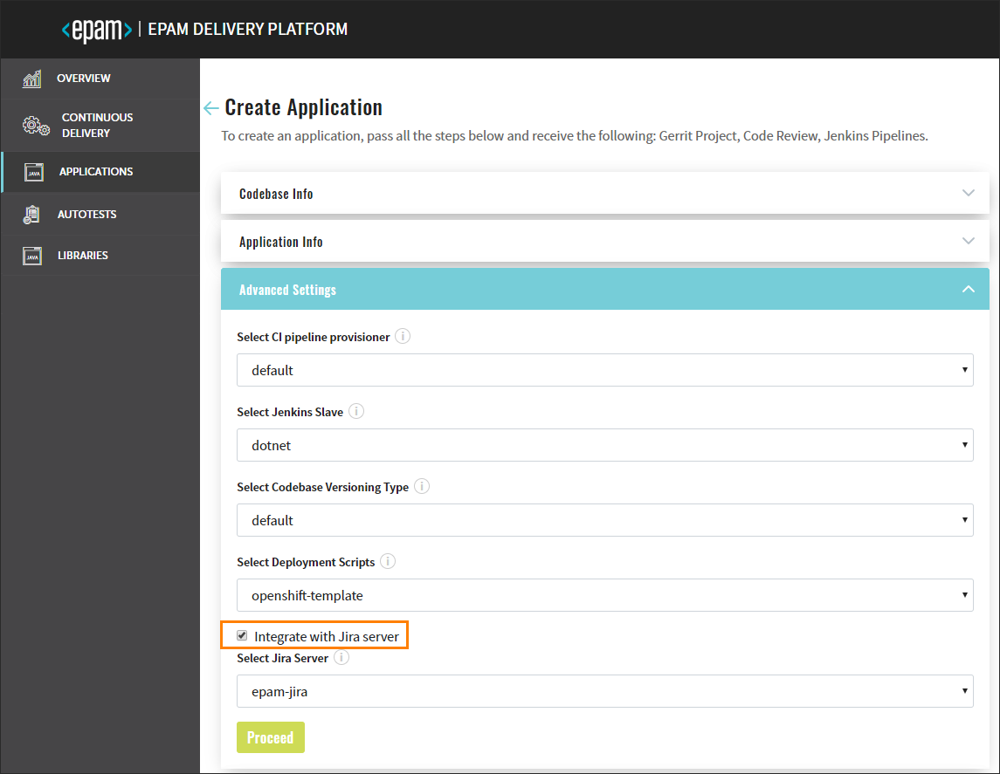

# Adjust Integration With Jira Server

In order to adjust the Jira server integration, first add JiraServer CR by performing the following:

1. Create Secret in the OpenShift/K8S namespace for Jira Server account with the **username** and **password** fields:

    ```yaml
    apiVersion: v1
    data:
      password: passwordInBase64
      username: usernameInBase64
    kind: Secret
    metadata:
      name: epam-jira-user
    type: kubernetes.io/basic-auth
    ```
2. Create JiraServer CR in the OpenShift/K8S namespace with the **apiUrl**, **credentialName** and **rootUrl** fields:

    ```yaml
    apiVersion: v2.edp.epam.com/v1alpha1
    kind: JiraServer
    metadata:
      name: epam-jira
    spec:
      apiUrl: 'https://jiraeu-api.epam.com'
      credentialName: epam-jira-user
      rootUrl: 'https://jiraeu.epam.com'
    status:
      available: true
      last_time_updated: '2020-08-14T11:51:07.045048633Z'
   ```
   
    >_**NOTE**: The value of the **credentialName** property is the name of the Secret, which is indicated in the first point above._
                                                                                                                                                                                                    
3. Being in Admin Console, navigate to the Advanced Settings menu to check that the Integrate with Jira Server check box became available:  

    
    
### Related Articles
- [Adjust VCS Integration With Jira Server](../documentation/jira_vcs_integration.md)

