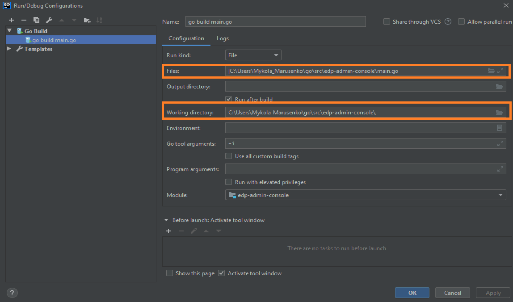

# Local Development
## Requirements:
* Go version (great than 1.13)

_**NOTE**: Make sure that environment variable GOPATH and GOROOT are added in PATH:_
```
export GOPATH=C:\Users\<<username>>\go
export GOROOT=C:\Go
```

* PostgreSQL client (great than 9.5 version)
* Configured access to the VCS (see [Gerrit Setup for Developer](https://kb.epam.com/display/EPMDEDP/Gerrit+Setup+for+Developer))
* GoLand Intellij Idea or another IDE

## Running operator:
1. Clone repository
2. Open folder in GoLand Intellij Idea and select Add Configuration → Go Build
 
3. Set the path to the main.go file in Files field and path to the Working directory for operator
 
4. Create a PostgreSQL database, schema, and user for EDP Admin Console operator:
    ```
    ## Creating database with user
    CREATE DATABASE edp-install-wizard-db WITH ENCODING 'UTF8';
    CREATE USER postgres WITH PASSWORD 'password';
    GRANT ALL PRIVILEGES ON DATABASE 'edp-install-wizard-db' to postgres;
     
    ## Creating schema
    CREATE SCHEMA [IF NOT EXISTS] 'develop';
    ```
    EDP Admin Console operator supports  two modes for running: 
    * local
    * prod
    
    For local deploy modify <strong>edp-admin-console/conf/app.conf</strong> and set the following parameters:
    ```
    runmode=local
    [local]
    dbEnabled=true
    pgHost=localhost
    pgPort=5432
    pgDatabase=edp-install-wizard-db
    pgUser=postgres
    pgPassword=password
    edpName=develop
    ```
5. Run 'go build main.go' (Shift+F10)
 

6. After a successful setup and launching, you can see the result on http://localhost:8080
 

## Exceptional Cases
After Run 'go build main.go' see error: 
```
go: finding github.com/openshift/api v3.9.0
go: finding github.com/openshift/client-go v3.9.0
go: errors parsing go.mod:
C:\Users\<<username>>\Desktop\EDP\edp-admin-console\go.mod:36: require github.com/openshift/api: version "v3.9.0" invalid: unknown revision v3.9.0

Compilation finished with exit code 1
```

This problem can resolve by manual update go dependency using command:
```
go get github.com/openshift/api@v3.9.0
```