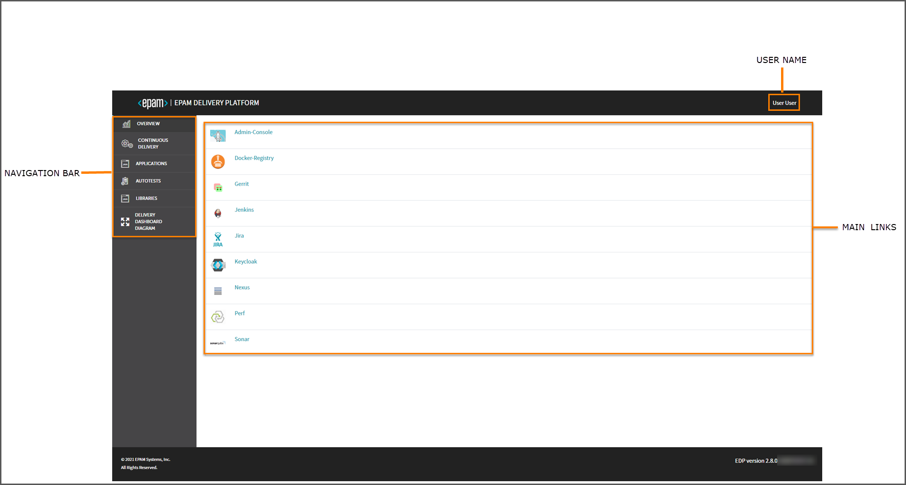

# EDP Admin Console
## Overview
Admin Console is a central management tool in the EDP ecosystem that provides the ability to deploy infrastructure, project resources and new technologies in a simple way. 
Using Admin Console enables to manage business entities:
* Create Codebases as Applications, Libraries and Autotests;
* Create/Update CD Pipelines;

_**NOTE**: To interact with Admin Console via REST API, explore the [Create Codebase Entity](documentation/rest-api.md) page._

 

- <strong>Navigation bar </strong>– consists of seven sections: Overview, Continuous Delivery, Applications, Services, Autotests, Libraries, and Delivery Dashboard Diagram. 
Click the necessary section to add an entity, open a home page or check the diagram.
- <strong>User name</strong> – displays the registered user name. 
- <strong>Main links</strong> – displays the corresponding links to the major adjusted toolset, to the management tool and to the OpenShift cluster.

Admin Console is a complete tool allowing to manage and control the added to the environment codebases (applications, 
services, autotests, libraries) as well as to create a CD pipeline and check the visualization diagram. 
Inspect the main features available in Admin Console by following the corresponding link:

1. [Add Applications](documentation/add_applications.md)
2. [Add Services](documentation/add_services.md)
3. [Add Autotests](documentation/add_autotests.md)
4. [Add Libraries](documentation/add_libraries.md)
5. [Add CD Pipelines](documentation/add_CD_pipelines.md)
6. [Delivery Dashboard Diagram](documentation/d_d_diagram.md)

_**NOTE**: The Admin Console link is available on the OpenShift overview page for your CI/CD project._

### Related Articles

* [Local Development](documentation/local_development.md)
* [GitHub Integration](documentation/github-integration.md)
* [GitLab Integration](documentation/gitlab-integration.md)
---
* [Adjust Import Strategy](documentation/import-strategy.md)
* [Adjust Integration With Jira Server](documentation/jira-server.md)
* [Add Jenkins Slave](https://github.com/epmd-edp/jenkins-operator/blob/master/documentation/add-jenkins-slave.md#add-jenkins-slave)
* [Add Job Provision](https://github.com/epmd-edp/jenkins-operator/blob/master/documentation/add-job-provision.md#add-job-provision)
* [Add Other Code Language](documentation/add_other_code_language.md)
* [Adjust VCS Integration With Jira Server](documentation/jira_vcs_integration.md)
* [Adjust GitLab CI Tool](documentation/ci-tool.md)
----
* [Add a New Custom Global Pipeline Library](documentation/cicd_customization/add_new_custom_global_pipeline_lib.md)
* [Customize CI Pipeline](documentation/cicd_customization/customize_ci_pipeline.md)
* [Customize CD Pipeline](documentation/cicd_customization/customize-deploy-pipeline.md)
* [Run Functional Autotest](documentation/cicd_customization/run_functional_autotest.md)
* [Clone Project via Git Bash Terminal](documentation/cicd_customization/clone_project_using_gitbash.md)

